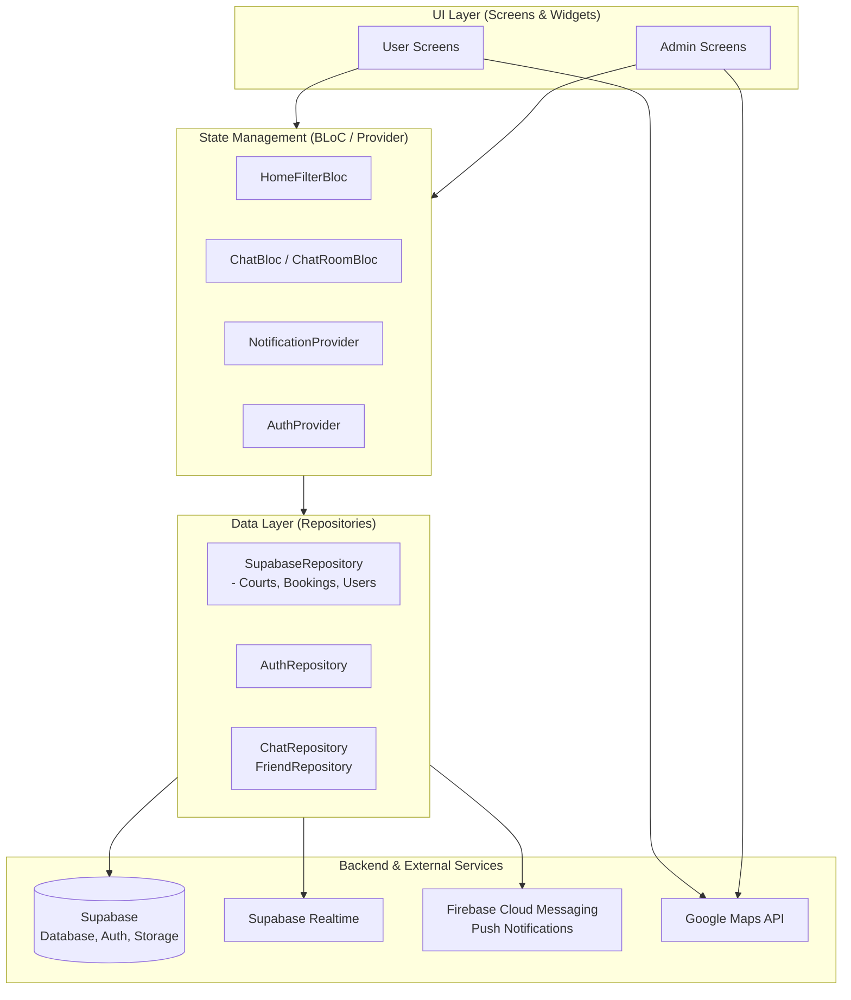
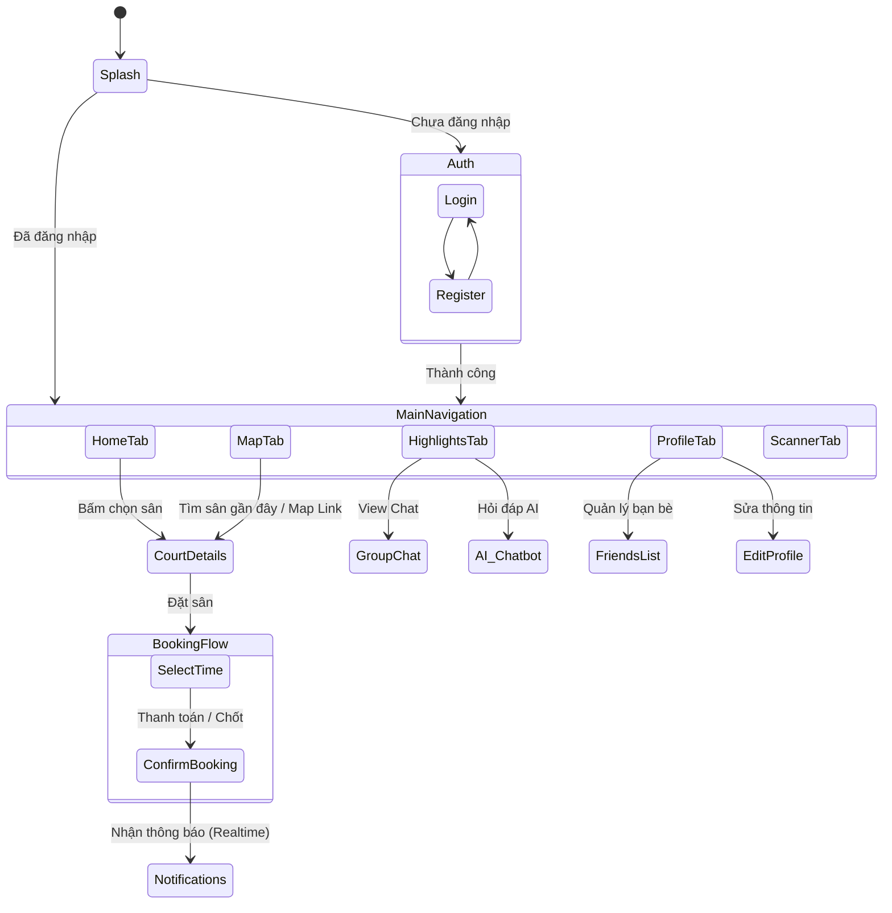
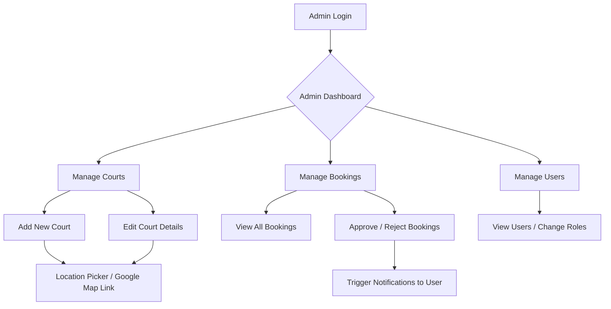

# Tổng quan Workflow Dự án Badminton AI

Dưới đây là sơ đồ workflow (luồng hoạt động) và kiến trúc tổng quan của dự án, giúp bạn có cái nhìn toàn cảnh để dễ dàng lên kế hoạch phát triển các tính năng trong tương lai.

## 1. Kiến trúc Hệ thống (System Architecture)

Dự án hiện đang áp dụng mô hình kiến trúc phân lớp (gần với Clean Architecture / MVVM) với `BLoC` và `Provider` để quản lý trạng thái, kết nối với Backend là **Supabase**.

---

## 2. Luồng Người dùng (User Flow)

Đây là hành trình chính của một người dùng bình thường (Player) trong ứng dụng:

---

## 3. Luồng Quản trị viên (Admin Flow)

Hành trình của Admin quản lý hệ thống và sân bãi:

---

## 4. Gợi ý Phát triển trong Tương lai (Future Roadmap)

Dựa trên cấu trúc hiện tại, dưới đây là một số hướng đi có thể mở rộng tính năng dễ dàng:

1. **Thanh toán trực tuyến (Online Payment):** 
   - Tích hợp cổng thanh toán (VNPay, Momo, ZaloPay) vào `BookingFlow` trước bước `ConfirmBooking`.
   - Cần thêm `PaymentRepository` bên phần Data Layer.

2. **Hệ thống AI nâng cao:**
   - Hiện đã có AI Chatbot ở màn Highlights, có thể tích hợp AI vào `HomeFilterBloc` để gợi ý sân (Recommendation System) dựa trên lịch sử đặt sân của user.

3. **Mạng xã hội & Tìm người chơi ghép (Matchmaking):**
   - Mở rộng chức năng `Group Chat` và `Friends` để cho phép tạo các "Trận đấu mở" (Open Matches) để người khác có thể xin tham gia (Join).

4. **Chấm công / Check-in QR:**
   - Module `ScannerTab` có thể kết hợp với hệ thống điểm danh (Attendance Architecture) mà bạn đã thiết kế trước đó, liên kết với màn `Manage Bookings` của Admin để check-in người đến ráo sân.
