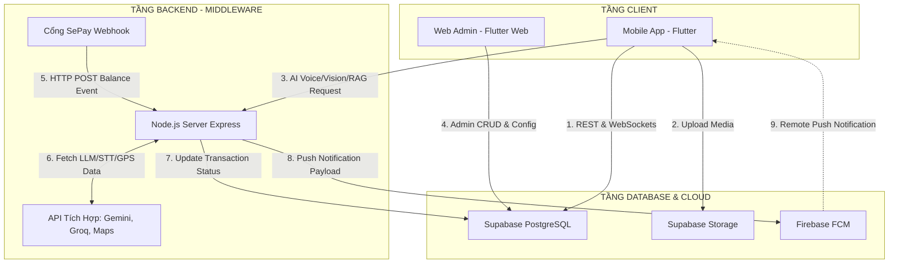
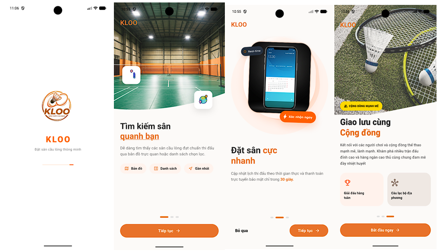
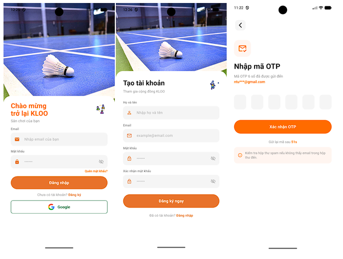
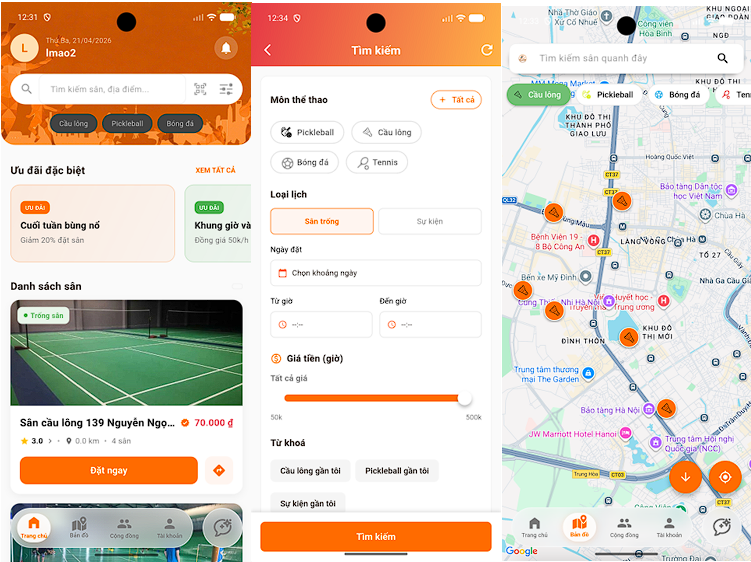
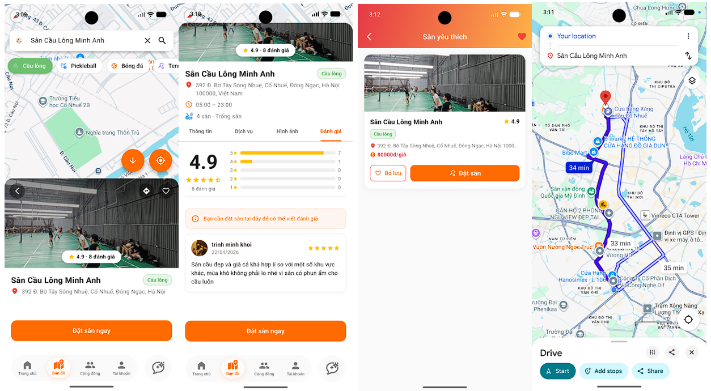
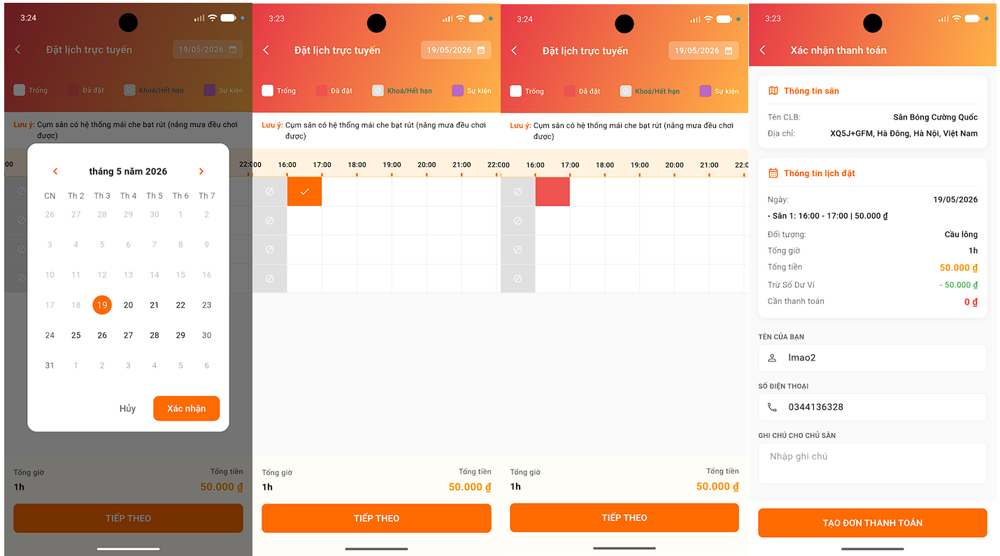
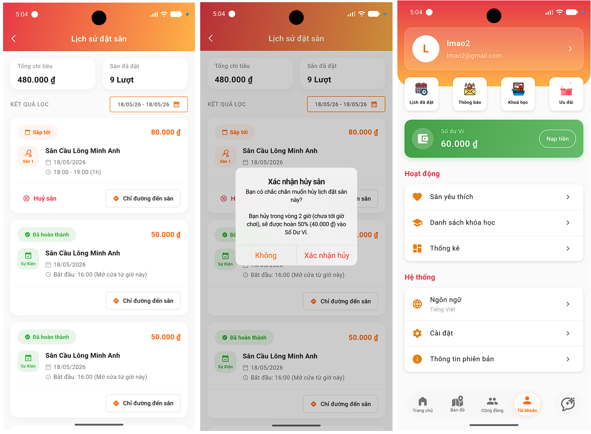
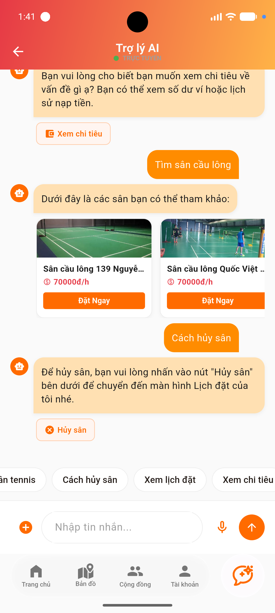

<h2 align="center">
    <a href="https://dainam.edu.vn/vi/khoa-cong-nghe-thong-tin">
    🎓 Faculty of Information Technology (DaiNam University)
    </a>
</h2>
<h1 align="center">
   ĐỒ ÁN TỐT NGHIỆP ĐẠI HỌC
</h1>
<h2 align="center">
   ỨNG DỤNG ĐẶT CHỖ VÀ QUẢN LÝ SÂN THỂ THAO TÍCH HỢP CHATBOT AI KLOO
</h2>

<div align="center">
    <p align="center">
        
        
        
    </p>

[](https://www.facebook.com/DNUAIoTLab)
[](https://dainam.edu.vn/vi/khoa-cong-nghe-thong-tin)
[](https://dainam.edu.vn)

</div>

---

## 1. 📖 GIỚI THIỆU CHUNG

**KLOO** là một hệ sinh thái quản lý và đặt sân thể thao đa chủ thể (SaaS) thông minh, được xây dựng và phát triển dưới dạng **ứng dụng di động đa nền tảng** sử dụng Flutter (Frontend), kết hợp **Node.js Express** (AI Middleware Middleware), và **Supabase PostgreSQL** (Cloud Database). 

Giải pháp hướng tới mục tiêu chuyển đổi số toàn diện các hoạt động vận hành cụm sân thể thao truyền thống, giải quyết triệt để các rủi ro đặt trùng lịch (Double Booking), kiểm soát giao dịch tài chính tự động và nâng cao trải nghiệm người dùng thông qua Trợ lý ảo AI tích hợp kỹ thuật tìm kiếm lai **Hybrid Search RAG** (Retrieval-Augmented Generation).

Hệ thống hỗ trợ 4 bộ môn thể thao chính bao gồm: **Cầu lông (Badminton), Pickleball, Bóng đá (Football), và Tennis**.

---

## 2. ⚡ CÁC TÍNH NĂNG NỔI BẬT

### 2.1. Đặt Chỗ & Giữ Chỗ Tạm Thời 5 Phút (Hold Booking)
Nhằm giải quyết triệt để vấn đề tranh chấp khung giờ khi nhiều người cùng đặt một sân con cùng một lúc (lỗi **Phantom Reads**), hệ thống triển khai cơ chế giữ chỗ tạm thời (Cinema-style Booking) ở tầng Database:
* **PostgreSQL Advisory Lock (`pg_advisory_xact_lock`):** Khóa logic giao dịch dựa trên mã băm của cụm sân và ngày để đảm bảo các luồng ghi được thực thi tuần tự.
* **Thời gian giữ chỗ:** Tự động tạo bản ghi `PENDING_PAYMENT` có thời hạn hết hiệu lực động (`expires_at = now() + 5 phút`).
* **Đồng bộ thời gian thực (Realtime WAL):** Trạng thái giữ chỗ được đẩy tức thời qua WebSocket để chuyển màu ô lịch trên ứng dụng của các người dùng khác (ô màu vàng).
* **Cơ chế giải phóng ca (Cleanup Holds):**
  * *Lazy Cleanup:* Tự động quét và dọn dẹp các ca giữ chỗ quá hạn mỗi khi có yêu cầu đặt sân mới.
  * *Client Release:* Người dùng chủ động hủy hoặc đồng hồ đếm ngược kết thúc sẽ gửi tín hiệu giải phóng sân ngay lập tức.
  * *Database Cron Job:* Tiến trình nền định kỳ dọn dẹp triệt để dữ liệu thừa.

### 2.2. Thanh Toán Tự Động VietQR & SePay Webhook
Hệ thống loại bỏ hoàn toàn việc đối soát thủ công bằng ảnh chụp màn hình nhờ tích hợp cổng Webhook:
* **VietQR Động:** Ứng dụng sinh mã QR thanh toán theo chuẩn EMVCo chứa sẵn mã định danh cú pháp (`DATSAN <BookingRef>` cho đặt sân, hoặc `NAPTIEN <UserIDShort>` cho nạp ví).
* **SePay Webhook (SHA-256):** Khi ngân hàng ghi nhận biến động số dư, SePay gửi HTTP POST Webhook về Node.js Server. Backend tiến hành xác thực chữ ký SHA-256 bảo mật và tự động cập nhật trạng thái đơn đặt thành `PAID` (trong 1-2 giây).
* **Ví điện tử nội bộ:** Hỗ trợ nạp tiền, trừ tiền thanh toán nhanh, và nhận tiền hoàn trả.

### 2.3. Hủy Sân & Hoàn Tiền Tự Động (Database Trigger)
Để ngăn chặn hành vi gian lận sửa đổi tham số số tiền hoàn từ phía Client App, toàn bộ logic hoàn tiền được xử lý nghiêm ngặt dưới Database bằng Trigger với quyền hạn **`SECURITY DEFINER`**:
* **Hủy trước giờ chơi $\ge$ 2 tiếng:** Hoàn tiền **100%** vào ví điện tử nội bộ của người dùng.
* **Hủy trước giờ chơi < 2 tiếng:** Hoàn tiền **50%** vào ví điện tử nội bộ.
* **Đã tới hoặc quá giờ chơi:** Hệ thống khóa tính năng hủy, hoàn trả **0%**.

### 2.4. Trợ Lý AI Chatbot RAG Thông Minh
Trợ lý ảo thông minh KLOO AI được xây dựng trên mô hình **Google Gemini** (`gemini-2.5-flash-lite` và `gemini-embedding-2-preview`) với các cải tiến RAG vượt trội:
* **Intent Routing (`quickIntent()`):** Bộ phân loại ý định nhanh để bỏ qua RAG đối với các câu chào hỏi đơn giản, giúp tiết kiệm chi phí và tăng tốc độ phản hồi.
* **Multi-turn Session Memory:** Duy trì ngữ cảnh hội thoại nhiều lượt dựa trên `sessionStore` (lưu trữ lịch sử tối đa 6 lượt chat, thời gian hết hạn TTL 30 phút).
* **Hybrid Search ( pgvector + BM25):** Truy xuất tri thức ngữ cảnh bằng công thức lai kết hợp độ tương đồng vector ngữ nghĩa **Cosine Similarity (60% weight)** và tìm kiếm từ khóa chính xác **BM25 ts_rank (40% weight)**. Điều này giúp loại bỏ hoàn toàn hiện tượng ảo giác (hallucination), trả lời chuẩn xác tên riêng cụm sân và các mã số giao dịch.
* **Two-pass Vision RAG:** Khi người dùng gửi hình ảnh (như hóa đơn chuyển khoản, bảng giá sân), hệ thống sử dụng Gemini Vision ở nhịp 1 để trích xuất từ khóa thô, sau đó mới tiến hành Hybrid Search và sinh câu trả lời ở nhịp 2.
* **GPS Location-Aware:** Tự động lấy tọa độ GPS từ thiết bị di động của người dùng, tính toán cự ly địa lý theo công thức Haversine để gợi ý danh sách các cụm sân gần nhất trong bán kính tùy chọn.
* **AI Action Routing:** Chatbot tự động trả về một đối tượng hành động JSON (`search_courts`, `view_schedule`, `view_expense`, `cancel_booking`) dựa trên ý định câu hỏi để định hướng Client App tự điều hướng trang thông minh.

### 2.5. Các Chức Năng Khác
* **Thông báo đẩy (FCM Push Notifications):** Thông báo biến động số dư, nhắc nhở lịch đặt sân, tự động dọn dẹp tokens FCM đã hết hạn khỏi DB.
* **Bản Đồ Số:** Tích hợp Google Maps hiển thị vị trí các sân và chỉ đường.
* **Cộng đồng:** Kết bạn, chat cá nhân (Realtime Chat) và chat nhóm để tìm đồng đội chơi thể thao.
* **Sự kiện & Giải đấu:** Tạo sự kiện giao lưu, khóa khung giờ sân trùng lặp tự động và cho phép người chơi đăng ký tham gia.
* **Bài giảng & Khóa học:** Cung cấp tài liệu, video hướng dẫn kỹ thuật chia theo từng trình độ của người chơi.

---

## 3. 🏗️ KIẾN TRÚC HỆ THỐNG (SYSTEM ARCHITECTURE)

Hệ thống được thiết kế theo mô hình **Kiến trúc 3 lớp (3-Tier Architecture)** kết hợp phương pháp Backend-as-a-Service (Supabase BaaS) và Serverless Middleware:



### 📋 Giải thích luồng hoạt động chính:
1. **Luồng Realtime đặt sân:** Client đọc/ghi dữ liệu lịch đặt qua `Supabase PostgreSQL`. Các thay đổi ghi vào tệp nhật ký ghi trước (WAL) được Supabase đẩy ngược về các Client khác bằng giao thức WebSockets.
2. **Luồng Chatbot AI:** Client gửi tệp ghi âm/hình ảnh/tin nhắn văn bản về `Node.js Server`. Server trung gian bảo mật API Key, gọi Groq Whisper để chuyển giọng nói thành text, gọi Gemini tạo Embedding, truy xuất pgvector + BM25 ở database, rồi gửi Prompt tổng hợp đến Gemini LLM để lấy kết quả định dạng JSON trả về cho Client.
3. **Luồng Thanh toán:** Khách quét VietQR động $\rightarrow$ Chuyển tiền thành công $\rightarrow$ SePay gửi Webhook HTTPS (SHA-256) về Node.js Server $\rightarrow$ Server cập nhật trạng thái `PAID` trên Supabase $\rightarrow$ Server gửi payload về Firebase FCM để đẩy thông báo thành công về điện thoại khách hàng dưới 3 giây.

---

## 4. 💻 CÔNG NGHỆ SỬ DỤNG

#### Frontend (Mobile App & Web Admin)
<p align="left">
  
  
  
  
</p>

#### Backend
<p align="left">
  
  
  
  
</p>

#### AI & Services
<p align="left">
  
  
  
  
</p>

#### Các Package & Thư viện chính:

* **Database & Cloud:** `supabase_flutter`, `firebase_core`, `firebase_messaging`, `flutter_local_notifications`
* **State Management:** `provider`, `flutter_bloc`, `rxdart`
* **Maps & Location:** `google_maps_flutter`, `geolocator`, `geocoding`, `permission_handler`
* **Media & Voice:** `image_picker`, `speech_to_text`, `record`
* **UI & Charts:** `fl_chart`, `cached_network_image`, `table_calendar`, `youtube_player_flutter`
* **Utilities:** `shared_preferences`, `http`, `intl`, `easy_localization`, `connectivity_plus`, `url_launcher`, `mobile_scanner`

---

## 5. 📂 CẤU TRÚC THƯ MỤC DỰ ÁN

### 📱 Frontend (badminton_ai)
```text
lib/
├── blocs/          # Quản lý trạng thái phức tạp dùng BLoC (HomeFilter, Chat)
├── config/         # Cấu hình hằng số, đường dẫn API
├── data/           # Lớp dữ liệu (Models, DTOs, Implement Repositories, Data Sources)
├── domain/         # Lớp nghiệp vụ (Entities, Usecases, Interfaces Repositories)
├── presentation/   # Giao diện người dùng (Màn hình chính, Widget dùng chung)
├── providers/      # Quản lý trạng thái toàn cục dùng Provider (Auth, Booking, Wallet)
├── screens/        # Phân chia các màn hình theo từng phân hệ chức năng
├── services/       # Các dịch vụ nền tảng (FCM Push Notification, Location)
├── utils/          # Các hàm tiện ích, cấu hình màu sắc, định dạng dữ liệu
├── viewmodels/     # Lớp ViewModel kết nối giữa Data và View
└── widgets/        # Các UI components tái sử dụng
```

### ⚙️ Backend (badminton_ai_backend)
```text
badminton_ai_backend/
├── firebase-service-account.json   # Key xác thực Firebase Admin SDK
├── ingest_kb.js                     # Script chunking và ingest dữ liệu tri thức vào DB
├── server.js                        # File khởi chạy chính Express Server (APIs chat, OTP, FCM)
├── package.json                     # Quản lý thư viện phụ thuộc Node.js
└── .env                             # Cấu hình biến môi trường bảo mật
```

---

## 6. 🚀 HƯỚNG DẪN CÀI ĐẶT & CẤU HÌNH

### 📋 Điều kiện cần thiết
* Máy tính đã cài đặt **Flutter SDK** (Phiên bản 3.9.0 trở lên).
* **Node.js** và **npm** cài đặt trên môi trường chạy Backend.
* Tài khoản dự án hoạt động trên **Supabase** và **Firebase Console**.
* Các API Keys bắt buộc:
  * `GEMINI_API_KEY` (Lấy từ Google AI Studio).
  * `MAILERSEND_API_KEY` (Lấy từ MailerSend để gửi OTP).
  * `GOOGLE_MAPS_API_KEY` (Lấy từ Google Cloud Console).
  * `MAILERSEND_FROM_EMAIL` (Email gửi đi đã được xác thực).

---

### 🔧 Các bước triển khai chi tiết

#### Bước 1: Nhân bản mã nguồn (Clone Repository)
```bash
git clone https://github.com/longgym23/BADMINTON_AI.git
cd BADMINTON_AI
```

#### Bước 2: Thiết lập Cấu hình Backend
1. Di chuyển vào thư mục backend:
   ```bash
   cd badminton_ai_backend
   npm install
   ```
2. Tạo file `.env` và cấu hình các biến bảo mật:
   ```env
   PORT=3000
   SUPABASE_URL=https://your-project-id.supabase.co
   SUPABASE_SERVICE_ROLE_KEY=your-supabase-service-role-key
   GEMINI_API_KEY=your-gemini-api-key
   GEMINI_EMBEDDING_MODEL=gemini-embedding-2-preview
   MAILERSEND_API_KEY=mlsn.your-mailersend-key
   MAILERSEND_FROM_EMAIL=your-verified-email@domain.com
   FIREBASE_SERVICE_ACCOUNT_JSON={"type":"service_account",...}
   ```
3. Đặt file xác thực `firebase-service-account.json` (tải từ Firebase Console) vào thư mục `badminton_ai_backend/`.
4. Nạp dữ liệu tri thức tri thức (Ingest Knowledge Base) vào cơ sở dữ liệu để chatbot hoạt động:
   * **Nạp tài liệu nghiệp vụ sân bãi:**
     ```bash
     npm run ingest:kb:file -- --file ../docs/bao_cao_do_an_ung_dung_dat_cho_va_quan_ly_san_cau_long_tich_hop_chatbot_ai.md --title "Graduation Report Knowledge" --upsert
     ```
   * **Đồng bộ danh sách thông tin sân hiện có từ DB vào kho RAG:**
     ```bash
     npm run ingest:kb:courts
     ```
5. Khởi chạy Backend Server:
   ```bash
   npm run start
   ```
   *Mặc định server chạy tại `http://localhost:3000` (Hoặc triển khai lên Render Cloud để lấy URL HTTPS).*

---

#### Bước 3: Thiết lập Cấu hình Frontend (Flutter App)
1. Quay về thư mục gốc dự án:
   ```bash
   cd ..
   flutter pub get
   ```
2. Cấu hình Firebase:
   * Tải tệp `google-services.json` (dành cho Android) từ Firebase Console đặt vào `android/app/`.
   * Tải tệp `GoogleService-Info.plist` (dành cho iOS) đặt vào `ios/Runner/`.
3. Cấu hình Google Maps API Key:
   * Cập nhật API Key trong file `android/app/src/main/AndroidManifest.xml`:
     ```xml
     <meta-data android:name="com.google.android.geo.API_KEY"
                android:value="YOUR_GOOGLE_MAPS_API_KEY_HERE"/>
     ```
4. Cấu hình kết nối Supabase và API Backend:
   * Mở file `lib/main.dart` và cập nhật thông tin khởi tạo Supabase URL và Anon Key.
   * Cập nhật URL kết nối Backend API trong file cấu hình `lib/config/`.
5. Chạy ứng dụng trên thiết bị giả lập hoặc thiết bị thật:
   ```bash
   flutter run
   ```

---

## 7. 📸 MỘT SỐ GIAO DIỆN CHƯƠNG TRÌNH

Dưới đây là một số hình ảnh thực tế cắt từ ứng dụng di động:

* **Màn hình Welcome của ứng dụng:**
  <p align="center">
    
  </p>

* **Đăng kí, đăng nhập và quên mật khẩu:**
  <p align="center">
    
  </p>

* **Trang chủ, tìm kiếm sân và bản đồ sân:**
  <p align="center">
    
  </p>

* **Màn chi tiết sân, tìm kiếm sân, sân yêu thích, dẫn đường:**
  <p align="center">
    
  </p>

* **Đặt sân và xác nhận thanh toán:**
  <p align="center">
    
  </p>

* **Màn hủy sân và hoàn tiền:**
  <p align="center">
    
  </p>
  
* **Màn chatbot AI RAG:**
  <p align="center">
    
  </p>
---

## 🎓 THÔNG TIN ĐỀ TÀI & SINH VIÊN THỰC HIỆN

| Trường thông tin | Nội dung chi tiết |
| :--- | :--- |
| **🏛️ Trường Đại Học** | Đại học Đại Nam (DaiNam University) |
| **💻 Khoa Đào Tạo** | Khoa Công nghệ Thông tin |
| **📚 Đồ án môn học** | Đồ án tốt nghiệp Đại học |
| **👤 Sinh viên thực hiện** | **Lê Đức Khánh Long** |
| **📧 Email Liên hệ** | longhjk345@gmail.com |
| **🏫 Lớp hành chính** | CNTT 16-03 |
| **📅 Năm học** | 2022 - 2026 |

---

<div align="center">
    <p><strong>© 2026 DaiNam University - Faculty of Information Technology</strong></p>
    <p>All rights reserved. Phát triển bởi Lê Đức Khánh Long.</p>
</div>
